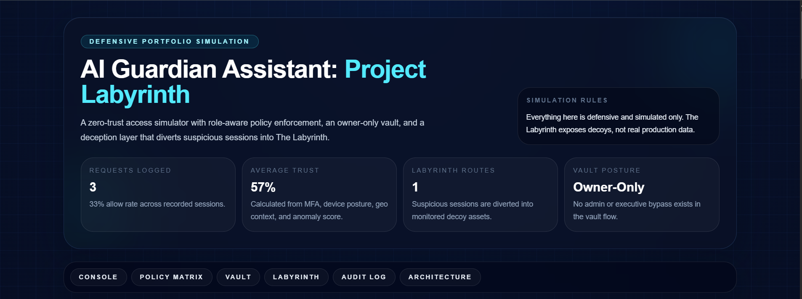
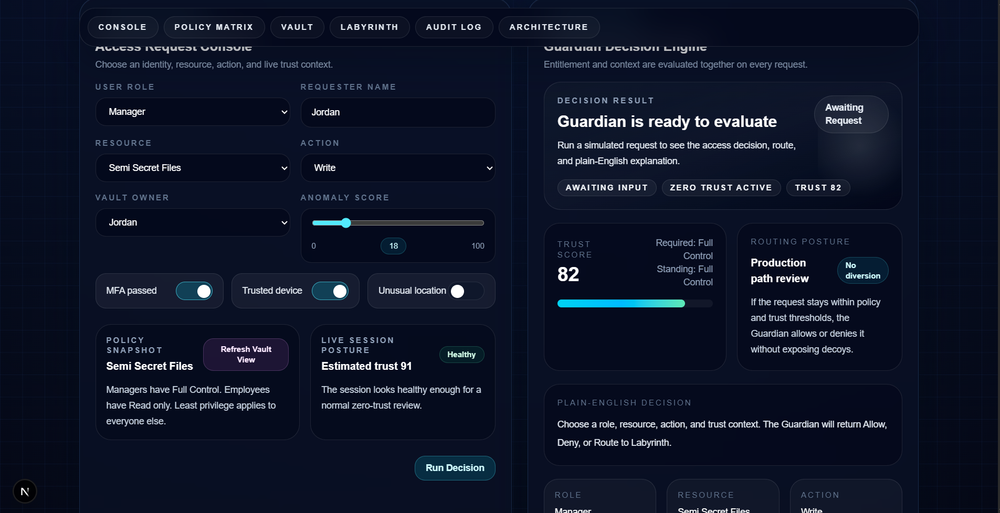
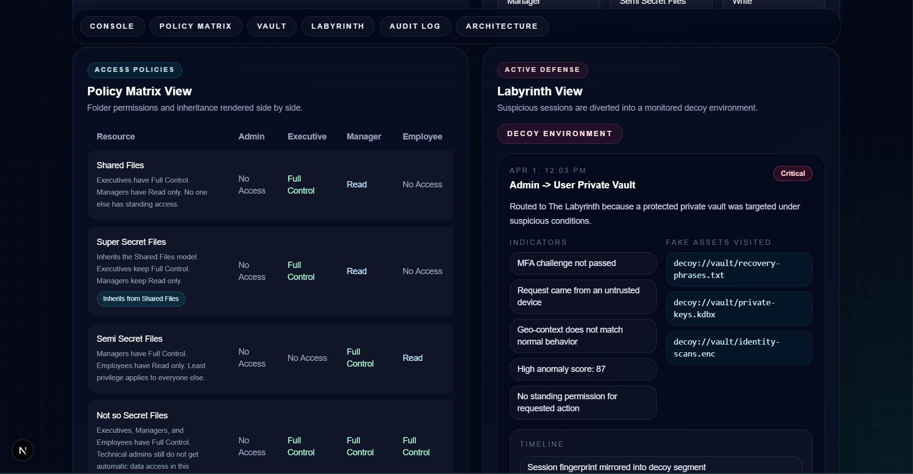
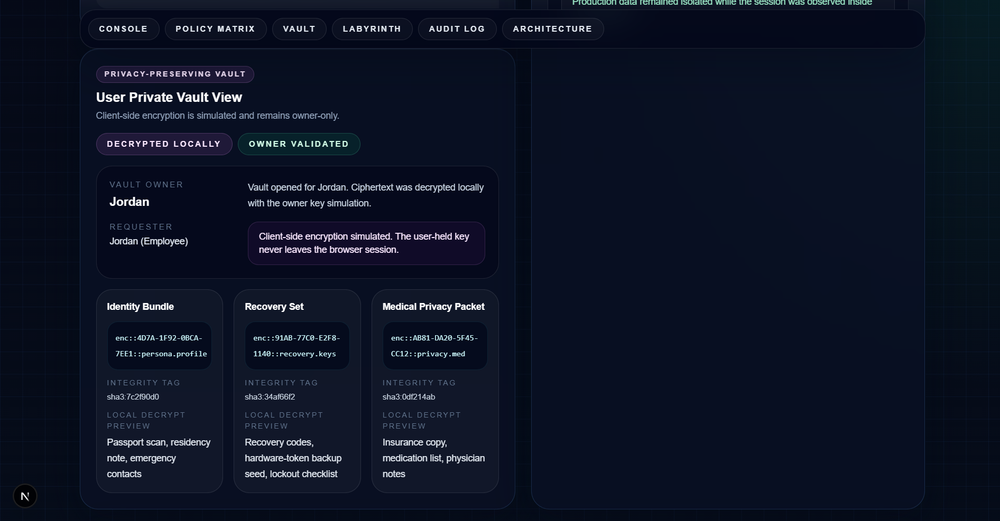
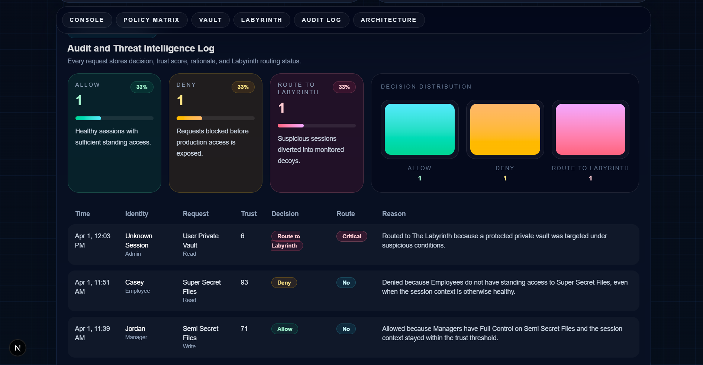
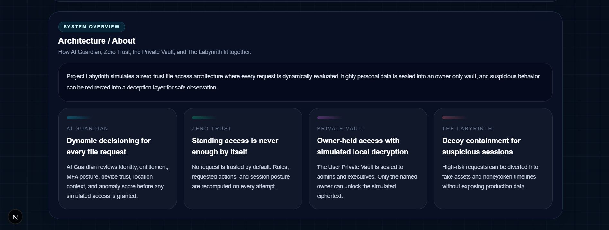

# AI Guardian Assistant: Project Labyrinth

A defensive, portfolio-ready zero-trust web app built with Next.js, Tailwind CSS, and SQLite.

## MVP scope

This app simulates a file access architecture with:

- An Access Request Console for role, resource, action, MFA, device trust, unusual location, and anomaly score
- A Guardian Decision Engine that returns `Allow`, `Deny`, or `Route to Labyrinth`
- A Policy Matrix View that shows folder permissions and inheritance
- A User Private Vault that stays owner-only and simulates client-side encryption
- A Labyrinth decoy environment with fake assets, indicators, timeline steps, and severity
- A SQLite-backed audit and threat intelligence log for every request

## Protected resources

- `Shared Files`
  - Executives: Full Control
  - Managers: Read
- `Super Secret Files`
  - Inherits from `Shared Files`
  - Executives: Full Control
  - Managers: Read
- `Semi Secret Files`
  - Managers: Full Control
  - Employees: Read
- `Not so Secret Files`
  - Executives, Managers, and Employees: Full Control
- `User Private Vault`
  - Specific user: Full Control
  - Admins and Executives: No Access
  - Decryption is simulated as owner-only inside the browser session

## Stack

- Next.js App Router
- React
- Tailwind CSS
- SQLite via `better-sqlite3`

## Getting started

```bash
npm install
npm run dev
```

Open [http://localhost:3000](http://localhost:3000).

## Defensive-only guardrails

- This app is simulation-only.
- The Labyrinth exposes decoy assets, not real production data.
- The private vault has no admin or executive bypass.
- No offensive tooling is included.

## Screenshots

### Hero Dashboard / System Overview


### Access Request Console and Guardian Decision Engine


### Policy Matrix and Labyrinth View


### User Private Vault View


### Audit and Threat Intelligence Log


### Architecture / About

