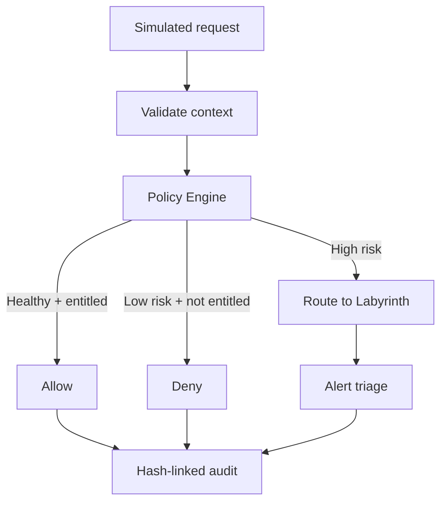

# AI Guardian Assistant: Project Labyrinth

Project Labyrinth is an explainable zero-trust detection-and-response lab. It evaluates simulated file-access requests with deterministic policy, diverts suspicious sessions into a defensive decoy environment, creates triageable alerts, and records every decision in a hash-linked SQLite audit log.

> **Defensive simulation:** this repository contains synthetic identities, fake vault records, and decoy asset paths. It is a learning and portfolio project—not a production authorization system, SIEM, honeypot, encryption product, or substitute for human security review.

## v0.2.0 highlights

- Eight replayable scenarios spanning normal activity, least privilege, account takeover, privilege escalation, credential replay, insider risk, and private-vault controls
- Fail-closed input validation and mandatory MFA for every allowed request
- Identity lifecycle, device posture, network zone, session age, and failed-attempt context in the trust calculation
- Step-by-step policy traces that separate deterministic decisions from advisory analyst summaries
- MITRE ATT&CK and D3FEND mappings on routed events
- Alert assignment, investigation status, disposition, containment, notes, and closure
- Owner-only vault simulation with no admin bypass, no unknown-owner fallback, and no plaintext preview over `GET`
- Hash-linked audit records with in-app integrity verification plus JSON and CSV exports
- Security headers, bounded demo rate limiting, ignored runtime databases, tests, linting, dependency audit, and GitHub Actions CI

## Decision flow


```mermaid
flowchart TD
    R["Simulated request"] --> V["Validate context"]
    V --> P["Policy Engine"]
    P -->|"Healthy + entitled"| A["Allow"]
    P -->|"Low risk + not entitled"| D["Deny"]
    P -->|"High risk"| L["Route to Labyrinth"]
    A --> U["Hash-linked audit"]
    D --> U
    L --> T["Alert triage"]
    T --> U
```

The deterministic Policy Engine is the sole decision authority. The analyst brief explains the result and suggests a next step, but it cannot change the outcome.

## Quick start

Requirements: Node.js 20.9 or newer and npm.

```bash
git clone https://github.com/AL91Cole/ai-guardian-assistant-project-labyrinth.git
cd ai-guardian-assistant-project-labyrinth
npm ci
npm run dev
```

Open [http://localhost:3000](http://localhost:3000). The app creates a local SQLite database under `data/` unless `LABYRINTH_DATA_DIR` points elsewhere.

Run the full local quality gate:

```bash
npm run check
npm audit --omit=dev --audit-level=high
```

See [README-RUN.md](README-RUN.md) for environment and production-run details.

## Scenario catalog

| Scenario | Expected decision | Security behavior |
|---|---|---|
| Baseline manager workflow | Allow | Healthy entitled write |
| Low-risk unauthorized read | Deny | Least-privilege enforcement |
| Impossible-travel account takeover | Route to Labyrinth | Valid-account abuse and compromised device |
| Privilege-escalation attempt | Route to Labyrinth | Account-manipulation behavior |
| Credential replay against a private vault | Route to Labyrinth | Brute-force and decoy credential controls |
| Suspended insider deletion attempt | Route to Labyrinth | Identity lifecycle overrides standing access |
| Healthy private-vault unlock | Allow | Known owner, owner-key signal, MFA, healthy device |
| Administrative vault-bypass attempt | Route to Labyrinth | No technical-admin access to private data |

## Policy model

| Resource | Classification | Standing access |
|---|---|---|
| Shared Files | Internal | Executive: Full; Manager: Read |
| Super Secret Files | Restricted | Inherits Shared Files |
| Semi Secret Files | Confidential | Manager: Full; Employee: Read |
| Not so Secret Files | Internal | Executive, Manager, Employee: Full |
| User Private Vault | Restricted | Named owner only; simulated owner-key signal required |

Admins deliberately receive no standing data permission. An administrative role represents platform operation, not ownership of user content.

## Architecture

| Layer | Implementation | Responsibility |
|---|---|---|
| Policy Enforcement Point | Next.js route handlers | Validate requests, apply the decision, isolate routed sessions |
| Policy Engine | `lib/guardian.js` | Calculate trust, resolve entitlement, and issue Allow/Deny/Route |
| Policy data | `lib/policies.js` | Define roles, resources, inheritance, and action requirements |
| Deception control | Labyrinth event model | Expose synthetic paths and defensive telemetry only |
| Case workflow | SQLite alerts + dashboard | Assign, investigate, contain, disposition, and close |
| Evidence | Hash-linked SQLite audit | Preserve evaluated context, traces, mappings, and decisions |
| Analyst assistance | Deterministic brief | Explain an outcome without decision authority |

More detail is in [docs/ARCHITECTURE.md](docs/ARCHITECTURE.md) and [docs/THREAT-MODEL.md](docs/THREAT-MODEL.md).

## API surface

| Endpoint | Method | Purpose |
|---|---|---|
| `/api/simulate` | `POST` | Validate, evaluate, persist, and return an access decision |
| `/api/vault` | `POST` | Return a locked preview or evaluate an owner-only vault request |
| `/api/scenarios` | `GET` | Return the built-in scenario catalog |
| `/api/logs` | `GET` | Return recent audit events and summary metrics |
| `/api/labyrinth` | `GET` | Return recent routed events |
| `/api/alerts` | `GET`, `PATCH` | List and update simulated analyst cases |
| `/api/audit/export` | `GET` | Export audit evidence as JSON or formula-safe CSV |
| `/api/health` | `GET` | Report app, policy, database, and audit-chain health |
| `/api/policies` | `GET` | Return the effective policy matrix and input options |

## Security properties and limits

- Unknown roles, resources, actions, and vault owners fail closed.
- Allowed decisions require successful MFA; private-vault access also requires the named owner, a simulated owner-key signal, and healthy context.
- The audit chain detects record modification but does not prevent a privileged operator from replacing the database and recomputing the chain. Production evidence would require an external append-only trust anchor.
- Rate limiting is process-local and intended only to bound accidental demo abuse. A distributed deployment needs a shared rate-limit store.
- The vault demonstrates authorization and UI states; it does not perform real client-side cryptography or store real secrets.
- The project has no authentication, tenant isolation, production data connector, notification integration, or automated response capability.

Please report security concerns according to [SECURITY.md](SECURITY.md).

## Standards alignment

The lab uses concepts from:

- [NIST SP 800-207, Zero Trust Architecture](https://csrc.nist.gov/pubs/sp/800/207/final)
- [CISA Zero Trust Maturity Model v2.0](https://www.cisa.gov/resources-tools/resources/zero-trust-maturity-model)
- [MITRE ATT&CK](https://attack.mitre.org/)
- [MITRE D3FEND](https://d3fend.mitre.org/)
- [NIST AI Risk Management Framework](https://www.nist.gov/itl/ai-risk-management-framework)

These references guide the educational model; they do not imply certification or formal compliance.

## Repository map

```text
app/                  Next.js pages and route handlers
components/           Modular dashboard and analyst workflow UI
docs/                 Architecture, threat model, and release notes
lib/                  Policy, validation, scenario, vault, audit, and DB logic
tests/                Policy and persistence regression suite
data/                 Runtime SQLite location (database files are ignored)
```

See [CHANGELOG.md](CHANGELOG.md) for release details and [CONTRIBUTING.md](CONTRIBUTING.md) before proposing changes.
