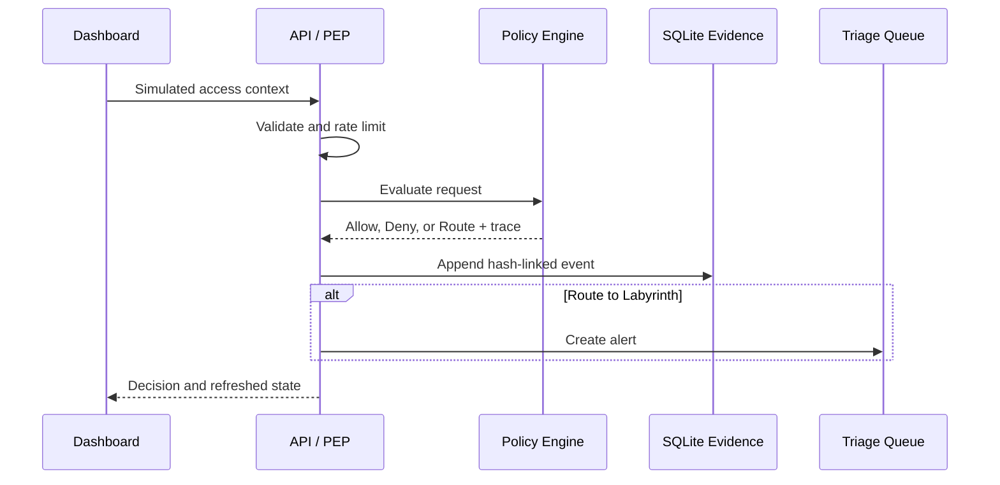

# Architecture

## Purpose

Project Labyrinth demonstrates how a policy decision, deceptive isolation, analyst workflow, and audit evidence can fit together in a small defensive lab. The implementation favors explainability and safe simulation over production completeness.

## Request lifecycle

## Components

### Policy Enforcement Point

Next.js route handlers form the lab's Policy Enforcement Point. They reject malformed input, invoke deterministic evaluation, persist the resulting evidence, and return only the modeled result. In a production design, enforcement would also occur at the protected resource rather than relying on a dashboard API alone.

### Policy Engine

`lib/guardian.js` combines standing authorization with request context:

- role-to-resource permission and action requirement
- mandatory MFA
- identity lifecycle status
- trusted-device and compliance posture
- location and network zone
- anomaly score and failed attempts
- session age
- private-vault ownership and owner-key signal

The engine emits an outcome, explanation, trust score, risk factors, and step-level policy trace. The analyst brief is produced after the decision and has no write-back path into authorization.

### The Labyrinth

High-risk requests are modeled as diverted into an isolated decoy segment. The event contains only synthetic asset URIs, indicators, a containment narrative, and ATT&CK/D3FEND references. No crawler, exploit, credential capture, persistence, retaliation, or interaction with a real target is implemented.

### Evidence and case state

SQLite stores evaluated request context, decisions, traces, mappings, analyst briefs, and alerts. Each audit event includes the previous event hash and its own SHA-256 hash. Verification recomputes the chain from `GENESIS` and identifies the first inconsistent record.

Alerts intentionally live outside the hashed decision payload so analysts can update operational case state without rewriting historical access evidence. In production, analyst updates should have their own immutable activity log.

## Trust boundaries

| Boundary | Inputs | Current control | Production gap |
|---|---|---|---|
| Browser to API | Scenario and ad hoc context | Strict field validation and process-local rate limit | Authentication, CSRF strategy, tenant binding, distributed quota |
| API to policy | Normalized request object | Enumerated roles/actions/resources and bounded values | Signed device/identity telemetry and policy distribution |
| Policy to protected data | Decision result | Demonstration only | Enforcement at every actual resource |
| API to SQLite | Audit and alert records | Prepared statements, transactions, hash linkage | Managed encrypted database, access control, backups, append-only anchor |
| Analyst UI to alerts | Case updates | Validated status/disposition/text | Analyst identity, authorization, activity audit, approvals |

## Data model

`audit_log` is append-oriented and records the state used at decision time. `alerts` references routed audit records one-to-one and stores mutable investigation workflow fields. Database files are generated at runtime, ignored by Git, and safe to replace only when the user intentionally wants a fresh demo history.

## Availability and scaling

The lab is designed for a single Node.js process and local SQLite file. The rate limiter, connection cache, and database are not appropriate for horizontally scaled or multi-tenant use. See the threat model for the controls that would be required before a shared deployment.
